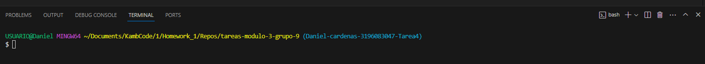

# Inicialización, Agregado y Subida de Archivos a GitHub con Git

Un fundamento para el desarrollo de software colaborativo y gestion  de proyectos es el versionar 
archivos, algunos de sus puntos clave son:

1. **Historial de cambios:** Git mantiene registro de las movidicacion realizadas, esto permite:
    * Revision de cambios
    * Identificacion de errores
    * Comprension del proceso
2. **Colaboracion efectiva:** Varios desarrolladores puede trabajar al mismo tiempo en diferentes
    partes del codigo sin dañar el trabajo de los demas.
3. **Revision y recuperacion:** Git permite revertir cambios en los archivos e incluso todo un 
proyecto de ser necesario, esto lo hace mediante las versiones anteriores llamadas "commits"
4. **Experimentacion segura:** Mediante el uso de ramas (branches), los desarrolladores puedes probar 
    caracteristricas o realizar experimientos en el codigo sin temor a dañar la rama principal "main" 
    o "master".
5. **seguimiento de responsabilidades:** Los cambios de Git estan registradfos a un usuario especifico
    Esto quiere decir que cada cambio tiene nombre especifico, lo que permite tener transparencia 
    sobre quien hizo que y cuando lo hizo.

## Iniciacion de un repositorio Git

Para comenzar a versionar archivos, debemos utilizar un commando llamado ```git init``` el cual permite 
iniciar el proceso, esto se hace de la siguiente forma:

1. Abrir la terminal y entrar en el modo "bash"

2. Escribir el comando ```git init```
```bash
git init
```
Esto crea un nuevo repositorio Git dentro de la carpeta selecionada, es en este repositorio en el que se
pueden crear y modificar archivos, que posteriormente estaran en Git.

## Agregar al area de proparacion o staging area

Cuando se realizan modificaciones en los archivos estas deben subirse por medio de la funcion commit, pero
para llegar a ese punto primero se debe pasar por el area de preparacion o sataging area, esta permite
que los cambios realizados se incluyan en el proximo commit, y se hace de la siguiente forma:

* En el modo bash de la terminal

```bash
git add . 
```
> El punto va separado del add para indicar que todos los cambios quse realizaron seran subidos al staging area

## Realizar un commit

Una vez se han agregado los cambios al staging area estos pueden ser consolidados en un commit
> Un commit en Git representa un punto en la historia del proyecto, este siempre lleva un mensaje descriptivo que explica los cambios realizados

* Commit de archivos agregados:
```bash
git commit -m "Mesaje descriptivo"
```
> este texto descriptivo es **muy importante** ya este ayuda a mantener un historial claro y organizado en los cambios que tien el codigo.

Por ejemplo al hacer cambios en un archivo JS se relizaria de la siguiente forma:
```bash
git commit -m "Agrego archivo nombredelarchivo.js"
```
## Vincular un repositorio local con GitHub

Para conectar un repositorio local (Esta en el pc), a un repositorio en GitHub (Esta en internet), es necesario
establecer un vinculo mediante el mando **git remote add**, y tener el URL del repositorio de GitHub, esto se hace
de la siguiente manera:

```bash
git remote add origin <URL_del_repositorio_de_git>
```
> Se debe reemplazar "<URL_del_repositorio_en_GitHub>" por el URL real de GitHub:

```bash
remote add origin https://github.com/sergio-ceballos-intelex/tareas-modulo-3-grupo-9
```
## Subir cambios a GitHub

Para finalizar el proceso se deben subir los cambios finales a GitHub, con el comando ```git push```, a su vez se 
usa la funcion **-u origin master** para declarar que la rama "master" sera donde se apliquen los cambios:

```bash
git push -u origin master
```
> Esto envia los commit locales de la rama **master** a GitHub el cual es el repositorio remoto, lo que permite quer los demas desarrolladores puedan ver los cambios y trabajar sobre los mismos de ser necesario.

### Conclusion

En estem corto tutorial se han cubierto los pasos esenciales para utilizar Git y GitHub, desde la inicializacion de un repositorio hasta la subida de cambios en GitHub, los comandos vistos son vitales para colaborar o desarrollar proyectos de software de la manera adecuada.

> Aqui abajo algunos links que te pueden servir para ahondar mas:

[Video tutorial](https://www.youtube.com/watch?v=eQMcIGVc8N0 "Como crear un Repositorio y Subir Proyecto a 👉GITHUB👈 Paso a Paso💻")

[Paso a paso](https://learn.microsoft.com/es-es/visualstudio/version-control/git-create-repository?view=vs-2022 "Paso a paso")