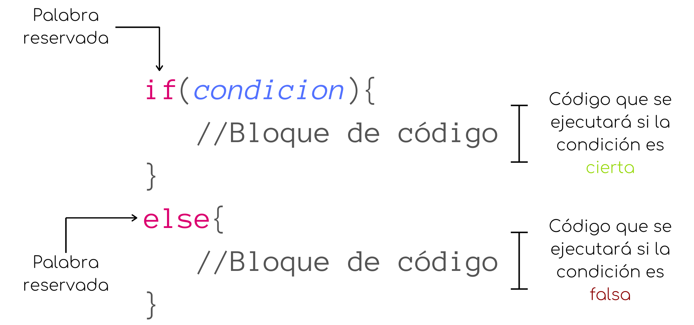
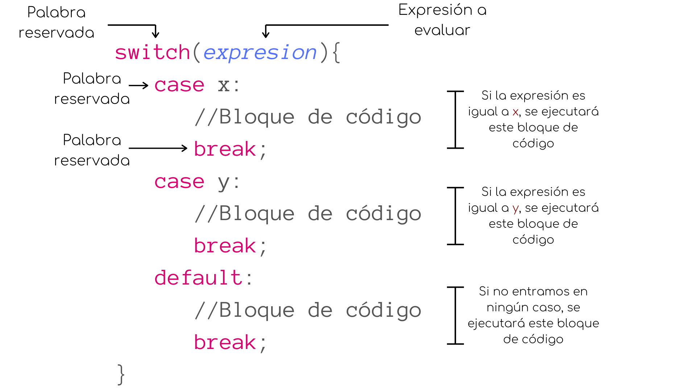

                        Estructuras de control

En Javascript, tenemos varias estructuras de control que nos permiten modificar el flujo de ejecución de nuestro código dependiendo de si se cumple o no cierta condición.

Podemos dividir estas estructuras de control en dos grandes grupos: condicionales y ciclos.

If-else
Muchas veces, debemos tomar la decisión de si ejecutaremos o una acción determinada en nuestro programa, es decir, dada cierta condición podemos determinar si se ejecutará un bloque de código u otro.

Para esto existen los Condicionales.

La estructura de control if else, es posiblemente la más utilizada en cualquier lenguaje de programación pues nos permite ejecutar un determinado bloque de código dependiendo de si una condición es verdadera o falsa.

La estructura if-else nos permite dividir el código (comportamiento) de cierta parte del programa dependiendo de el cumplimiento de cierta condición.

Podemos ver un ejemplo a continuación:

let i = 10;
if(i > 5){
    console.log(`El valor se i es mayor a 5`);
}
else{
    console.log(`El valor se i es menor a 5`);
}

Podemos ver que, en efecto, la condición entre paréntesis se evalúa a true, por lo que se ejecuta el código dentro del primer bloque de código.

La sentencia else le indica al código que, de no cumplirse la condición, se ejecutará el siguiente bloque de código. Podemos ver que solamente puede ejecutarse uno de los bloques a la vez pues el valor de la condición solamente puede ser o true o false, por lo que ambos bloques de código nunca se ejecutaran al mismo tiempo.

No siempre es necesario que se ejecute una acción cuando la condición no se cumple, por lo que también es posible utilizar la sentencia if por si sola.

let i = 2;
if(i % 2 == 0)
    console.log(`${i} es número par`);

Switch

La estructura switch surge de un concepto conocido como caza de patrones: la idea es que dada una expresión esta se evalúe y se ejecute el código correspondiente a ese caso. Si no encontramos un caso que coincida con la expresión, se ejecutará el bloque de código definido es default, aunque no es obligatorio definir este caso.

Los pasos que se ejecutan en una estructura switch son:
1. La expresión del switch es evaluada.
2. Se compara el valor resultante con cada uno de los casos (case).
3. Si existe una coincidencia, se ejecuta el bloque de código correspondiente al case y la ejecución de la estructura termina al llegar al break.
4. En otro caso, si no hay coincidencias, se ejecuta el caso por defecto (default).

brake es una palabra reservada del lenguaje que nos permite terminar de forma instantánea la ejecución de un bloque de código.

En el caso de la estructura switch es esencial colocar un break al final de cada caso (incluyendo el default), pues de lo contrario, se ejecutarían también 

                          cuales son:

JavaScript ofrece una variedad de estructuras de control, como bucles for, while, do-while, y estructuras if-else y switch, que permiten controlar el flujo de ejecución en un programa.

                          Por que existen:
Las estructuras de control existen ya que nos permiten modificar los flujos de ejecución de nuestro codigo dependiendo de si se cumplen o no ciertas instrucciones en el codigo. Estas estucturas las podemos dividir en 2 grupos: ciclos y condicionales.

