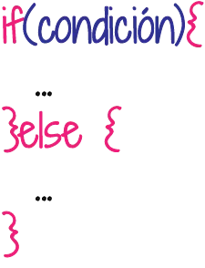
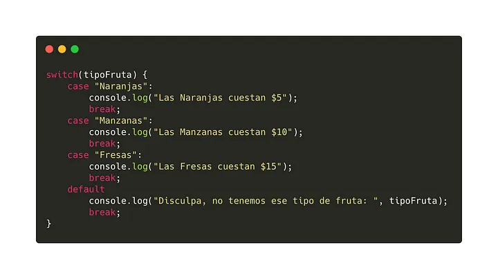

# ¿Qué son las estructuras de control?
Las estructuras de control son el conjunto  de reglas que permiten controlar el flujo  de ejecución  de las instrucciones de un algoritmo o un programa.

Con estas podemos alterar, controlar o modificar el orden o flujo en el que se ejecutan las instrucciones de un software a voluntad.

La mayoría de los lenguajes de programación actuales soportan o utilizan las mismas estructuras de control o, al menos, son muy parecidas. Lo que varía entre uno y otro es la sintaxis con la que se escriben, y por lo tanto, con la que los compiladores o intértrepes lo traducen a lenguaje de máquina.

## Existen 3 tipos de estructuras de control en programación:
* 1. Secuenciales
* 2. Selectivas
* 3. Iterativas

1. Secuenciales
	Esta es la estructura básica, ya que nos permite asegurar que una instrucción se ejecuta después de la otra siguiendo el orden en que fueron escritas. Es la base de la programación estructurada. De ahí que el comando GOTO sea desestimado como una buena práctica: un programa bien pensado, diseñado e implementado no necesitará eesta sentencia.
	INSTRUCCIÓN 1 
	INSTRUCCIÓN 2 
	.
	.
	.
	INSTRUCCIÓN N
2. Selectivas, de selección o condicionales
Este tipo de estructuras de control nos sirven cuando necesitamos que se evalúe el valor de alguna variable o de alguna condición para decidir qué instrucciones ejecutar a continuación.
	Selecticas simples
	Evalúan un valor o una condición y determinan las instrucciones a ejecutar en caso de cumplirse la condición.
		SI<CONDICIÓN>ENTONCES
			INSTRUCCIÓN/ES
		FIN SI
	Selectivas dobles
	Evalúan un valor o una condición. Determinan las instrucciones a ejecutar en caso de cumplirse la condición y también las instrucciones a ejecutar en caso de no cumplirse.
		SI<CONDICIÓN> ENTONCES
			INSTRUCIÓN/ES
			SI NO
				INSTRUCCIÓN/ES
			FIN SI
	Selectivas múltiples o anidadas
	Permiten combinar selectivas simples y dobles para crear estrucutras y condiciones más complejas cuando el algoritmo en cuestión lo necesite.
	SI<CONDICION> ENTONCES
		INSTRUCCIÓN 1
	SI NO
		SI<CONDICIÓN 2> ENTONCES
			INSTRUCCIÓN 2
		SI NO
			INSTRUCCIÓN 3
		FIN SI
	FIN SI
3. Iterativas, de iteración, de repetición o repetitivas.
	Este tipo de estructuras de control nos sirven cuando necesitamos que se ejecute un conjunto específico de instrucciones en diversas ocaciones. La cantidad de veces que se repite dicho bloque de acciones puede ser estático o puede depender del valor de alguna variables o de alguna condición. 
	* 3.1. Iterativaas con cantidad fija de iteraciones
	Se utilizan cuando a priori se conoce la cantidad de ocasiones que debe repetirse un bloque de instrucciones. Normalmente, usan una variable de iteración o índice para contar la cantidad de repeticiones que se han realizado.
	* 3.2. Iterativas con cantidad variable de iteraciones
	Se utilizan cuando la cantidad de ocasiones que debe repetirse un bloque de instrucciones está determinado por una condición. Por lo regular, existen dos variantes: repetir un bloque de instrucciones mientras se cumpla una condición o repartirlo hasta que se cumpla una condición.

# Estructuras de control en Javascript
1. Condicionales
	Los condicionales nos permiten evaluar si una condición cumple o no con lo que estemos evaluando. Su sintaxis es muy sencilla, podemos evaluar si la condición es verdadera o falsa. Incluso añadir una condición intermedia en el caso de que no se cumpla la primera condición y se deban evaluar más.
	
2. Ciclos, bucles o Loops
	Se le pueden llamar, ciclos, bucles o loops, en ellos se evalua una condición n veces hasta que esta se cumpla. En estos podemos encontrar los for, while, entre otros.‌
	* 2.1. for
		for([expresioninicial];[condición];[expresiónincremento])
			sentencia
		Un bucle for se repite como mencione hasta que la condición que se esta evaluando se cumpla.
	* 2.2. while
		Ejecuta una sentencia mientras la condición que se este evaluando sea verdadera.
		while(condición)
			sentencia
	* 2.3. Switch
		Permite evaluar una expresión e intenta igual el valor de esa expresión a una etiqueta llamada case, que es el caso a evaluar. En el caso de que la condición se cumpla o lo que tiene el case, se ejecuta la sentencia que este en ese caso.
		
