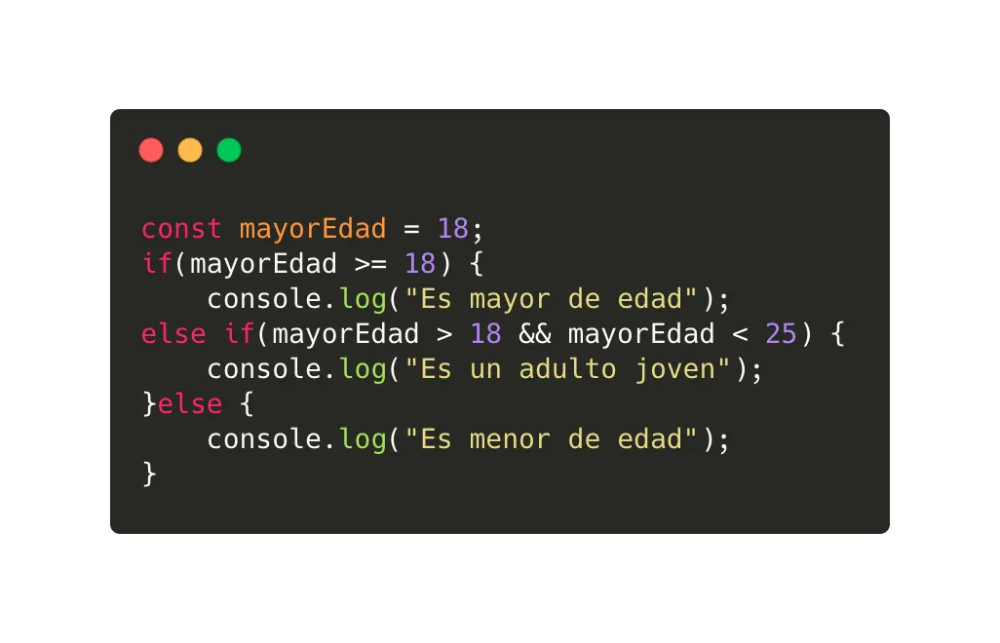

Las estructuras de control en JS tambien son denominadas control statements, nos  permiten tomar decisiones y realizar un proceso varias veces. esto trata estructuras muy importantes ya que estas estan encargadas de controlar el flujo en un programa.
 
Las estructuras de control existen ya que nos permiten modificar los flujos de ejecución de nuestro codigo dependiendo de si se cumplen o no ciertas instrucciones en el codigo. Estas estucturas las podemos dividir en 2 grupos: ciclos y condicionales.
En JS las estructuras decontrol son varias:
los bucles: for, while, do-while
las etucturas: if-else y switch.